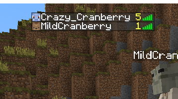

# HeadHunterPlugin
Minecraft Spigot Plugin for Hunting Mob Heads.

### Shout outs
- Shout out to the plugin that this plugin is based off of: https://www.spigotmc.org/resources/moremobheads.73997/. A lot of my code is copied/referenced from this plugin from JoelGodOfWar.
- Shout out to this post for a scoreboard API that I'm using. https://www.spigotmc.org/threads/scoreboard-api-1-8.160095/

## Description
Sometimes after a while of playing vanilla Minecraft with my friends, we run out of stuff to do.
This plugin has given us new end game goals to try to collect as many heads as possible.
It's just a for-fun addition to vanilla Minecraft inspired by Pokemon shining hunting and RuneScape pet hunting.

## Features
Every mob now has a slim chance of dropping their head. When a player receives a head, a message will broadcast to the server.
This drop is saved in a yml file along with the total kills per mob per player.

The number of unique heads a player has received is displayed as a scoreboard in the TAB player list:

## Configurations

See available configurations [here](configurations.md).

## Commands

#### /kc (/killcount)

#### /hc (/headcount)

#### /heads

### /mobs

### /headhunterrefresh
Re-loads `chance_config.yml`, `head_hunter_config.yml`, and `mob_name_translations.yml`
files without having to restart the server. Requires OP permission.

## Contact Me
Discord: https://discord.gg/UTjtJPTjGG
