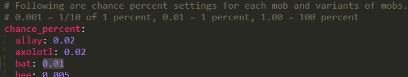

## Drop Rates

To adjust drop rates simply edit the `chance_config.yml` file:

## Head Hunter Configurations

These configurations are found in `head_hunter_config.yml`

**display_score_in_player_list**
- Shows the number of unique heads in the player_list when true.
- Default: true

**looting_enchantment.affects_drop_rate**
- Whether or not the looting enchantment affects the head drop rates.
- Default: false

**looting_enchantment.drop_rate_multiplier**
- How much looting should affect the drop rate. A value of 0.1 would give a player
with looting III a 30% higher chance of receiving a head (Exact math shown in config file comment).
- Default: 0.05

__messages.*__
- Customize the messages broadcast from this mod. Good for translating to your native language.
- See the various messages and their defaults [here](src/main/resources/head_hunter_config.yml).

----------------------------------------------------------
Please contact me in [my Discord Server](https://discord.gg/UTjtJPTjGG) if you have any other ideas for configuration options.